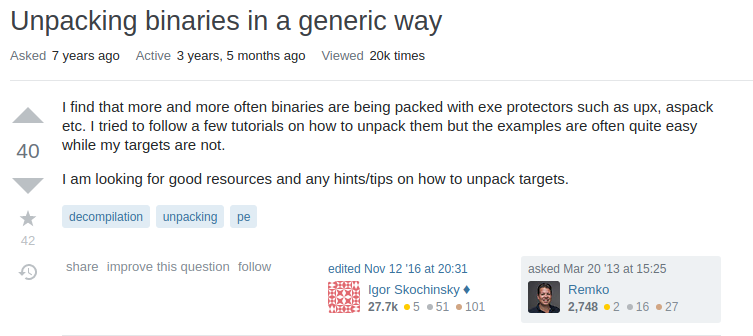
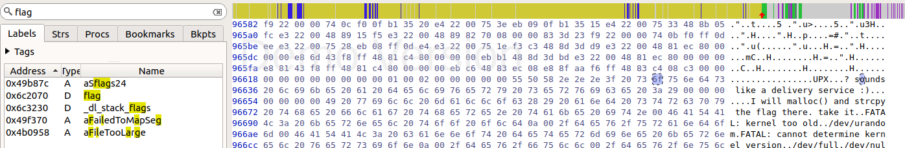

**flag (7 Points)**


The challenge stated "Papa brought me a packed present! let's open it."

I did a quick google search for "reversing binary packing" and found this





I tried downloading the first tool, upx, and use it on my binary.

```diff
$ upx -d flag
```

I saw strings outputted a regular output and gdb could disassemble main

```diff
$ gdb flag
(gdb) disas main
Dump of assembler code for function main:
   0x0000000000401164 <+0>:	push   rbp
   0x0000000000401165 <+1>:	mov    rbp,rsp
   0x0000000000401168 <+4>:	sub    rsp,0x10
   0x000000000040116c <+8>:	mov    edi,0x496658
   0x0000000000401171 <+13>:	call   0x402080 <puts>
   0x0000000000401176 <+18>:	mov    edi,0x64
   0x000000000040117b <+23>:	call   0x4099d0 <malloc>
   0x0000000000401180 <+28>:	mov    QWORD PTR [rbp-0x8],rax
   0x0000000000401184 <+32>:	mov    rdx,QWORD PTR [rip+0x2c0ee5]        # 0x6c2070 <flag>
   0x000000000040118b <+39>:	mov    rax,QWORD PTR [rbp-0x8]
   0x000000000040118f <+43>:	mov    rsi,rdx
   0x0000000000401192 <+46>:	mov    rdi,rax
   0x0000000000401195 <+49>:	call   0x400320
   0x000000000040119a <+54>:	mov    eax,0x0
   0x000000000040119f <+59>:	leave  
   0x00000000004011a0 <+60>:	ret    
End of assembler dump.

```

I opened the binary in hopper and searched for the word flag, and found the flag string.

