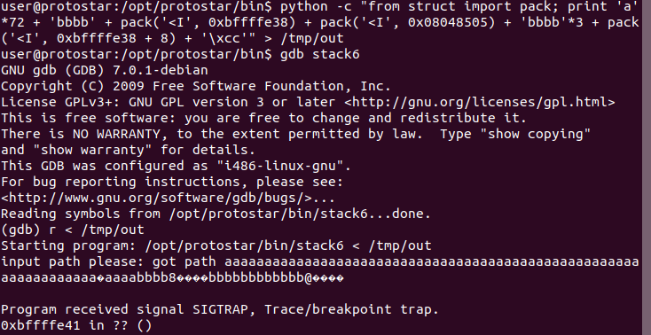
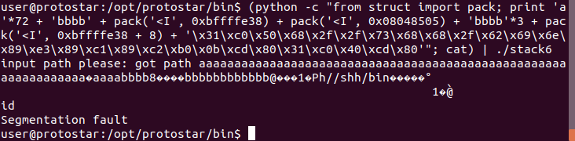
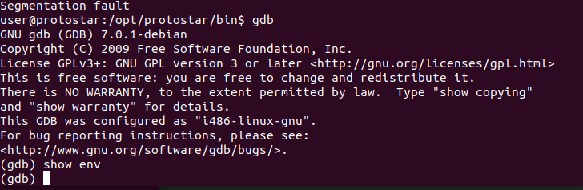

**Stack6**

I know we need to somehow overcome the eip check.
ROP is what I used

Success!
Now, let's try it outside of gdb.

Doesn't seem to work even though show env in gdb returns and empty list.

